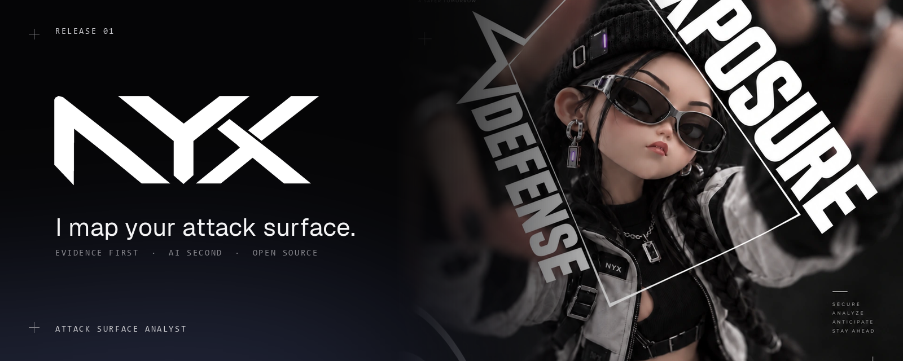
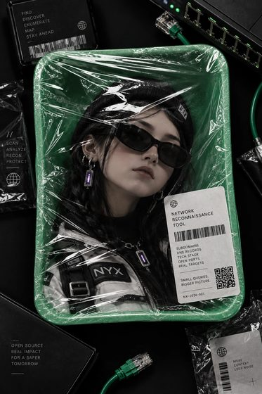
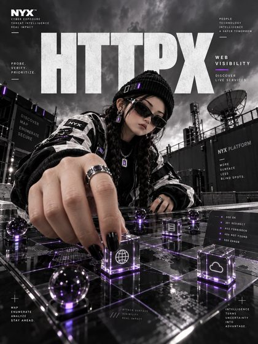
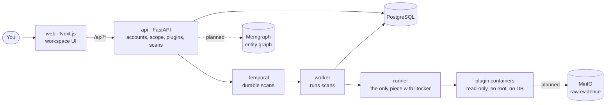

<p align="center">
  
</p>

<p align="center"><b>I map your attack surface.</b><br>Open-source scanners, raw evidence behind every finding, and only the tools the last result justifies.<br><sub>Early days: the platform core and my first plugins run today; full scans are being built. See the <a href="#roadmap">roadmap</a>.</sub></p>

<p align="center">
  <a href="https://github.com/TechnoVizor/NYX/actions/workflows/ci.yml"></a>
  
  
  
  
</p>

---

<table>
<tr>
<td width="34%"></td>
<td>

### Who I am

I'm **NYX**. Give me a domain you own and I'll find everything it shows to the internet: forgotten subdomains, open services, login pages nobody remembers putting up, a staging server that should have been switched off last spring.

I'm built for the people who have to answer "what do we actually expose?" — a small security team, a solo pentester, a student learning recon the honest way. The idea is simple: don't drown you in a thousand alerts, keep the proof for every single thing I tell you, and explain why it matters in plain words.

I'm also a bachelor's thesis. The question behind me: can a scanner that **thinks before it runs the next tool** do the same job with less noise and less waste? This repository is where that gets built and measured.

</td>
</tr>
</table>

## What a scan looks like

Every scan is a short story. Here's one, step by step.

| | |
|---|---|
|  | **Scope check.** Before I send a single packet, I check that the target is yours and on the list you signed. If it isn't, I stop. |
|  | **Subfinder.** I ask public sources which subdomains exist. Quiet, passive, nobody gets touched. |
|  | **dnsx.** I resolve what I found and flag the dangling records someone could take over. |
|  | **httpx.** I knock on the live ones and note what answers: titles, tech, login pages. |
|  | **Planner.** I decide what's worth running next. No repository? Then no secret scanner. I don't run tools just because I have them. |
|  | **Nuclei.** Known weaknesses get checked with templates, and every hit keeps its raw request and response. |
|  | **Correlate.** Hosts, services, certificates and findings go into one graph, so you see how things connect. |
|  | **Report.** You get a report you can rerun and check: same inputs, same evidence, same conclusions. |

> This is where I'm headed. Today I chain Subfinder, dnsx and httpx: every host I find goes through the scope check and on to the next tool, in batches, each tool in its own locked-down container, and a scan survives restarts. The planner that picks tools by what it found is next; see the [roadmap](#roadmap).

## What I refuse to do

These are the rules I'm being built on. They are design constraints, not marketing — each one lands with the phase that needs it.

- **Scan what you don't own.** Targets go through a scope registry first. Out of scope means refused, not "warned".
- **Let plugins wander.** Every scanner runs in its own box: rootless runtime, no Docker or Podman socket, read-only filesystem, network limited to your scope, per-target rate limits, no database credentials.
  Today: read-only, non-root, no capabilities, CPU/RAM/process limits, a time limit, and no route to the database, the API or the runner: only the web UI is published, which is all a plugin can see of this machine. Next: network egress limited to your scope.
- **Make things up.** Risk comes from evidence and vulnerability data, not from a language model's mood. AI helps me sort and explain; it never invents a finding.

## How I'm built



Solid lines run today. Dotted lines are the next phases.

## Run me

You need Docker.

```bash
git clone https://github.com/TechnoVizor/NYX.git
cd NYX
docker compose --profile plugins build   # my scanners: Subfinder, dnsx, httpx
docker compose up --build
```

Open <http://localhost:3001>. The **first account you create becomes the admin**; after that sign-up closes (set `NYX_ALLOW_SIGNUP=true` to keep it open). The API stays private to the containers; the web app talks to it for you.

Before I run anything, add a target under **Settings → Scope** and say who allowed it. I refuse everything else. Then start a scan at **Scans → New scan**. For a safe playground, `docker compose --profile lab up -d testbed` starts a local nginx at `testbed.nyx-lab.test`: add `nyx-lab.test` to scope with active scanning allowed and scan `testbed.nyx-lab.test` with dnsx and httpx.

Everything listens on `127.0.0.1` only, on purpose.

<details>
<summary>Putting me on a server</summary>

1. Start me locally on the server and create the admin account first (an SSH tunnel to port 3001 works), so nobody else can claim it.
2. Put a TLS reverse proxy (Caddy, nginx) in front of `127.0.0.1:3001`.
3. Set `NYX_COOKIE_SECURE=true` so the session cookie only travels over HTTPS.
4. Use a strong `POSTGRES_PASSWORD`. Stick to letters and digits: it goes into a database URL.
5. Set `NYX_RUNNER_TOKEN` to a long random value.
</details>

<details>
<summary>Developing without containers</summary>

```bash
docker compose -f docker-compose.yml -f compose.dev.yml up -d postgres runner temporal   # publishes them on 127.0.0.1 for host-side tools

# terminal 1
cd api && uv sync && uv run alembic upgrade head && NYX_RUNNER_TOKEN=nyx-local-runner-token uv run uvicorn app.main:app --reload --port 8000

# terminal 2: the worker that executes scans
cd api && NYX_RUNNER_TOKEN=nyx-local-runner-token uv run python -m app.worker

# terminal 3
cd web && pnpm install && pnpm dev --port 3001
```

Scan history and every activity attempt are in the Temporal Web UI at <http://127.0.0.1:8233>.

Tests: `cd api && uv run pytest` (they use a separate `nyx_test` database, your accounts are safe). Workflow tests download Temporal's test server; on a network that blocks `temporal.download`, run them against the dev server with `NYX_TEMPORAL_TEST_ADDRESS=127.0.0.1:7233`. Lint: `uv run ruff check .`, `pnpm lint`.
</details>

## Teach me a new scanner

Copy `plugins/_template`, describe the tool in `plugin.yaml` (what it accepts, what it produces, how risky it is, how much CPU and memory it gets), and turn its JSON output into events in `adapter.py`. `api/tests/test_adapters.py` shows how to test it offline against a recorded fixture.

## Repository map

| Path | What lives there |
|---|---|
| `api/` | FastAPI service and the scan worker: accounts, scope, plugin registry, scans on Temporal. Migrations in `api/alembic`. |
| `web/` | The workspace UI: sign-in, plugins with live runs, scope settings. Scans, findings and the rest are placeholders on mock data for now. |
| `docs/` | Design specs and implementation plans. |
| `plugins/` | The plugin contract (JSON Schemas), the one-file SDK, a template, and Subfinder, dnsx, httpx. |
| `runner/` | The only service with Docker access: starts each plugin in a locked-down container. |
| `scripts/` | Tools that build the images in this README. |

## Roadmap

- [x] **1. Core platform** — monorepo, FastAPI, PostgreSQL, accounts and roles, Docker Compose, CI
- [x] **2. Plugin specification** — manifest schema, canonical events, plugin registry, first three plugins
- [ ] **3. Workflow engine** — Temporal scan workflow, plugin activities, retries, cancel and pause (done); network egress limited to scope (next)
- [ ] **4. Default plugin set** — Subfinder, dnsx, httpx, Nuclei and friends
- [ ] **5. Evidence and graph** — immutable hash-addressed evidence in MinIO, entity graph in Memgraph
- [ ] **6. Adaptive planner** — decide the next tool from what the last one found
- [ ] **7. AI gateway** — bounded routing, extraction and evidence-backed explanations
- [ ] **8. Diff and risk** — what changed since the last scan, risk from objective data
- [ ] **9. Experiment mode** — reproducible runs against a ground-truth testbed
- [ ] **10. Evaluation** — the numbers for the thesis

## Research

Three questions I'm built to answer honestly, results to come from experiments, not promises:

- **H1 · Triage.** Does AI-assisted triage cut the findings a human has to review, without losing the ones that matter?
- **H2 · Orchestration.** Does running tools adaptively use fewer runs and resources than "run everything", with the same coverage?
- **H3 · Graphs.** For multi-hop questions ("which exposed login pages sit on hosts with a known CVE?"), is a graph database faster than relational storage as depth grows?

## License

[Apache-2.0](LICENSE). Use me, fork me, teach me a new scanner — and only point me at targets you're allowed to test.

<br>
<p align="center">
  <picture>
    <source media="(prefers-color-scheme: dark)" srcset=".github/assets/logo-dark.png">
    
  </picture>
  <br>
  <sub>Scan only what you own.</sub>
</p>
